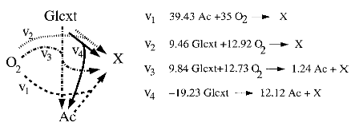

# Bioprocess Optimization Problem

#### Description

Consider a fed-batch process of _E. coli_ growing on glucose and acetate. We want to optimize the glucose feed to maximize cellular concentration in the end of the batch. However, instead of using [Monod equation](https://en.wikipedia.org/wiki/Monod_equation) to represent cellular growth, we will use a more detailed model that uses the microrganism's metabolic network, namely flux balance analysis (FBA), so we can better represent growth on both substrates. Flux balance analysis (FBA) is essentially an optimization problem that calculates the flow of metabolites (internal or external cellular products) through a metabolic network[^1], in which the objective function is usually set to maximize cellular growth. FBA was originally proposed for steady state analysis, but it has been adapted to model dynamic processes as well[^2]. 

[^1]: [Orth, J. D., Thiele, I., and Palsson, B. Ø. What is flux balance analysis? _Nature biotechnology_, 28(3), 245-248, 2010.](https://www.nature.com/articles/nbt.1614)

[^2]: [Mahadevan, R., Edwards, J. S., and Doyle III, F. J. Dynamic flux balance analysis of diauxic growth in _Escherichia coli_. _Biophysical journal_, 83(3), 1331-1340, 2002.](https://www.sciencedirect.com/science/article/pii/S0006349502739039)

For this case study, we consider a simplified metabolic network with 4 overall reactions (only external metabolites are considered), as shown in [2], to model cellular growth.



The feed in this batch process contains only glucose, but acetate can be produced by the cell and is available in the medium initially. The rate of glucose uptake is limited by the [Michaelis-Menten equation](https://en.wikipedia.org/wiki/Michaelis%E2%80%93Menten_kinetics) and availability of oxigen in the medium is limited by mass transport from the gas phase. Given a fixed amount of glucose to be added to the bioreactor, we want to find a feed flow profile that maximizes biomass concentration in the end of the process. Mathematically, this problem is formulated as

```math
    \begin{aligned}
        \min_D \quad &-x_\text{end} \\
        \text{s.t.} \quad & \sum_i D_iz_\text{glu,f} = \text{Glu}_\text{total} \\
                          &D \ge 0 \\
                          &\min_{z,x,v} \quad -\sum_{r \in \mathcal{R}} v_r \\
                          &\text{s.t.} \quad \frac{dz_\text{glu}}{dt} = A^\text{glu}vx + D(z_\text{glu,f} - z_\text{glu}) \\
                          &\quad \quad \quad \frac{dz_\text{Ac}}{dt} = A^\text{Ac}vx - Dz_\text{Ac} \\
                          &\quad \quad \quad \frac{dz_{\text{O}_2}}{dt} = A^{\text{O}_2}vx - Dz_{\text{O}_2} + kLa(0.21 - z_{\text{O}_2}) \\
                          &\quad \quad \quad \frac{dx}{dt} = \sum_{r in \mathcal{R}}v_r x - Dx \\
                          &\quad \quad \quad A^\text{glu}v \le \frac{v_\text{glu,max}z_\text{glu}}{K_m + z_\text{glu}} \\
                          &\quad \quad \quad -A^{\text{O}_2}v \le v_{\text{O}_2,\text{max}} \\
                          &\quad \quad \quad A^\text{Ac}v \le 100 \\
                          &\quad \quad \quad z,x,v \ge 0 
    \end{aligned}
```
where ``D = F/V``(feed flow rate divided by the volume of the bioreactor) is the dilution rate, ``z_i`` is the concentration of the ``i^\text{th}`` metabolite in the bioreactor, ``z_\text{glu,f}`` is the glucose concentration in the feed, Glu``_\text{total}`` is the total amount o glucose to be fed to the bioreactor during the process, ``v_r`` is the rate of reaction ``r \in \mathcal{R}``, A is the stoichiometry matrix (superscript ``i`` means the row corresponding to metabolite ``i``), ``kLa`` is the mass transfer coefficient for oxygen, ``x`` is biomass concentration in the bioreactor, ``v_\text{glu,max}`` and ``K_m`` are parameters for the Michaelis-Menten equation, and ``v_{\text{O}_2,\text{max}}`` is the maximum rate for oxygen consumption. 

#### Implementation

We considered two scenarios for this implementation, file [fed_batch.jl](https://github.com/Process-Optimization-and-Control/MPCCLibrary/tree/main/scripts/bioprocess/fed_batch.jl) implements the dynamic FBA model with constant ``D = \text{Glu}_\text{total}/z_\text{glu,f}\text{NFE}``, where NFE is the number os finite elements in the time discretization and file [fed\_batch_opt.jl](https://github.com/Process-Optimization-and-Control/MPCCLibrary/tree/main/scripts/bioprocess/fed_batch_opt.jl) implements the bilevel optimization just described. The latter is reformulated as an MPCC problem and solved. Orthogonal collocation with 3 collocation points and 77 finite elements was implemented. In both cases, the required values used are

``A^\text{glu} = [\begin{array}{cccc}0 & -9.46 & -9.84 & -19.23\end{array}]``, \
``A^{\text{O}_2} = [\begin{array}{cccc} -35 & -12.92 & -12.73 & 0\end{array}]``, \
``A^\text{Ac} = [\begin{array}{cccc} -39.43 & 0 & 1.24 & 12.12\end{array}]``, \
``x_0 = 0.001`` g/L, \
``z_{\text{glu},0} = 1`` mmol/L, \
``z_{\text{O}_2,0} = 0.21`` mmol/L, \
``z_{\text{Ac},0} = 0.4`` mmol/L, \
``v_{i,0} = 0``, \
``t_0 = 0``, \
``t_\text{end} = 11`` h, \
``kLa = 7.5`` h``^{-1}``, \
``v_{\text{O}_2,\text{max}} = 15`` mmol/gDW.h, \
``v_\text{glu,max} = 10`` mmol/gDW.h, \
``K_m = 0.015`` mmol/L, \
``z_\text{glu,f} = 5`` mmol/L.