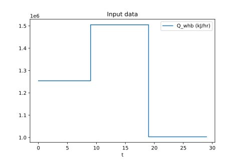

# Thermal Energy Storage Problem

#### Description 
Water returns from the district at ``T_\text{dh,ret}`` with a constant flow ``q_\text{dh}`` and is mainly heated in the waste heat boiler (WHB). Heat supply to WHB ``Q_\text{whb}`` fluctuates, thus an additional boiler that uses fossil fuel (PHB) is also necessary for periods when heat demand is higher than the supply to WHB. However, to minimize fuel consumption, an energy storage tank (TES) can be used to store energy when supply is higher than demand and this energy can be later used when ``Q_\text{whb}`` is not sufficient. The goal here is to find an operation that minimizes ``Q_\text{phb}`` given a profile of ``Q_\text{whb}`` for a time period. A scheme of this problem is presented below. 


Here ``q_A`` and ``q_B`` correspond, respectively, to the flow associated with charging and discharging the energy storage tank (TES). Note that volume ``V_\text{tes}`` is constant, which means that if, for example, TES is discharging, there is a flow equals to ``q_A`` of water that returned from the district going straight to TES. 

Mathematically, the problem is modeled as

```math
    \begin{aligned}
        \min_{x,u,z} \quad &\int Q_\text{phb}^2 dt \\
         \text{s.t.} \quad &\frac{dT_\text{tes}}{dt} = \frac{q_\text{A}}{V_\text{tes}}(T_\text{A} - T_\text{tes}) + \frac{q_\text{B}}{V_\text{tes}}(T_\text{B} - T_\text{tes}) \\
                           &\frac{dT_\text{phb}}{dt} = \frac{q_\text{dh}}{V_\text{phb}}(T_\text{C} - T_\text{phb}) + \frac{Q_\text{phb}}{V_\text{phb}\rho_\text{dh}Cp_\text{dh}} \\
                           &\frac{dT_\text{whb}}{dt} = \frac{q_\text{whb}}{V_\text{whb}}(T_\text{A} - T_\text{whb}) + \frac{Q_\text{whb}}{V_\text{whb}\rho_\text{dh}Cp_\text{dh}} \\
                           &q_\text{bypass} = q_\text{dh} - q_\text{A} + q_\text{B} - q_\text{whb} \\
                           &T_\text{A} = \frac{q_\text{dh}T_\text{dh,ret} + q_\text{B}T_\text{tes}}{q_\text{dh} + q_\text{B}} \\
                           &T_\text{B} = \frac{q_\text{whb}T_\text{whb} + q_\text{A}T_\text{tes}}{q_\text{whb} + q_\text{A}} \\
                           &T_\text{C} = \frac{q_\text{bypass}T_\text{A} + (q_\text{dh} - q_\text{bypass})T_\text{B}}{q_\text{dh}} \\
                           &0 \le q_\text{A} \perp q_\text{B} \ge 0
    \end{aligned}
```
where the state variables ``x`` are ``T_\text{tes}``, ``T_\text{phb}``, and ``T_\text{whb}``, the control varaibles ``u`` are ``q_\text{whb}``, ``q_\text{A}``, ``q_\text{B}``, and ``Q_\text{phb}``, and the additional algebraic variables ``z`` are ``q_\text{bypass}``, ``T_\text{A}``, ``T_\text{B}``, and ``T_\text{C}``. The first three constraints correspond to the dynamic model of the state variables, the next three constraints are mass and energy balance equations (algebraic constraints) for mass and energy, and the last constraint correponds to the complementarity of variables ``q_A`` and ``q_B``.

#### Implementation 
Values restrictions used for this example are ``q_\text{dh} = 10 \text{ m}^3/\text{h}``, ``T_\text{dh,ret} = 30 ^\text{ o}\text{C}``, ``60 ^\text{ o}\text{C} \le T_\text{phb} \le 70 ^\text{ o}\text{C}``, and ``q_\text{whb} \le 15 \text{ m}^3/\text{h}``, and the profile for ``Q_\text{whb}`` is shown in the figure below. Heat from WHB matches heat necessary to bring the returned water to ``60 ^\text{ o}\text{C}`` for the first 10 time intervals; then, it is increased in 20 % and later decrased in 20 %. 



Instead of using the algorithm implementation available in this library, this problem is solved by simply adding a penalty term of the form ``k_cq_Aq_B``, where ``k_c`` is a tuning parameter, to the objective function to enforce the complementarity condition(s). In addition, this problem has too many degrees of freedom and multiple solutions, and two different approaches for restricting the problem to one solution is implemented. In [tes_reg.jl](https://github.com/Process-Optimization-and-Control/MPCCLibrary/blob/main/scripts/tes_reg.jl) regularization terms were added to the objective function to enforce some desired behaviour (for example, avoiding frequent swaps between ``q_A`` and ``q_B``). In [tes_logic.jl](https://github.com/Process-Optimization-and-Control/MPCCLibrary/blob/main/scripts/tes_logic.jl), two logical constraints are added as complementatity constraints, more especifically, 
```math
    0 \le T_\text{phb,ub} - \text{min}(T_B, T_\text{phb,ub}) \perp q_\text{bypass} \ge 0
```
and
```math
    0 \le q_\text{whb,ub} - q_\text{whb} \perp T_\text{phb} - T_\text{phb,lb} \ge 0. 
```
The first constraint can be read as
```math
    \begin{aligned}
        &\text{if } T_\text{B} > T_\text{phb,ub} \\
        &\quad \quad q_\text{bypass} > 0 \\
        &\text{otherwise} \\
        &\quad \quad q_\text{bypass} = 0. 
    \end{aligned}
```
Note that it has the minimum operator, which can be written as another complementary constraint using auxiliary variables (see Powell et al, 2016[^1]). The second constraint says that if WHB hasn't reached full capacity, ``T_\text{phb}`` should be kept at the minimum bound so that all excess energy provided to WHB can be kept within the system.

[^1]: [Powell, K.M., Eaton, A.N., Hedengren, J.D. and Edgar, T.F. A continuous formulation for logical decisions in differential algebraic systems using mathematical programs with complementarity constraints. _Processes_, 4(1), p.7, 2016.](https://www.mdpi.com/2227-9717/4/1/7)